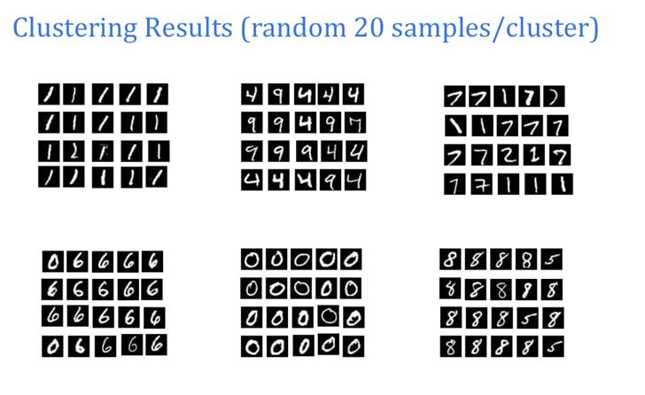
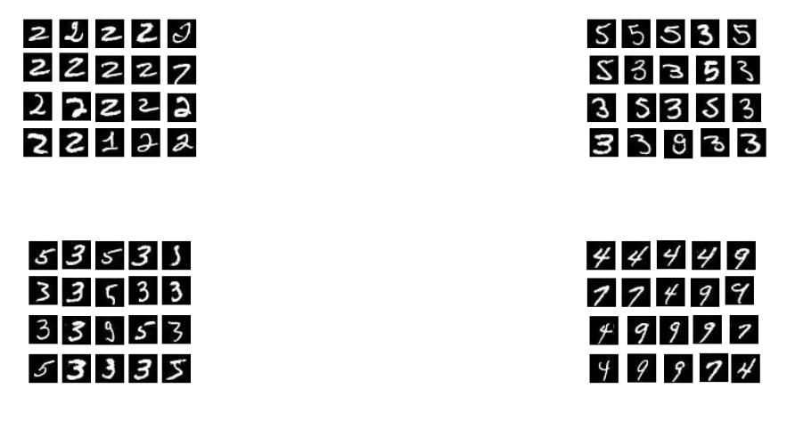
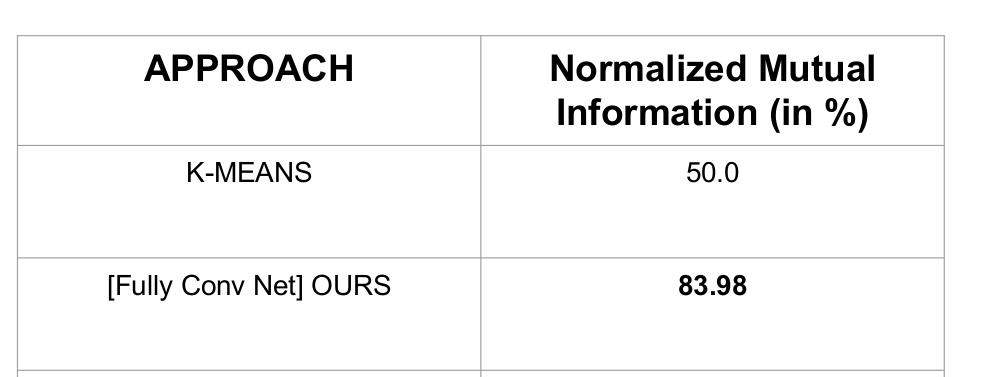

# Deep-Clustering
A Convolutional Neural Network based model for Unsupervised Learning

# Results
Here is a comparison plot of K-Means and our CNN based model on 2D data generated from two Gaussian samples
    
&emsp;&emsp;&emsp;&emsp;&emsp;&emsp;Input Plot &emsp; &emsp;&emsp;&emsp;&emsp;&emsp;&emsp;&emsp;&emsp;&emsp;&emsp;&emsp; K-Means Plot&emsp;&emsp;&emsp;&emsp;&emsp;&emsp;&emsp;&emsp;&emsp;&emsp;&emsp;&emsp;&emsp;NN Plot  

We next performed Clustering on MNIST dataset(784 dimensional data) and extracted a few samples from each cluster

 
Our CNN based model far exceeded the K-Means algorithm in NMI score 

